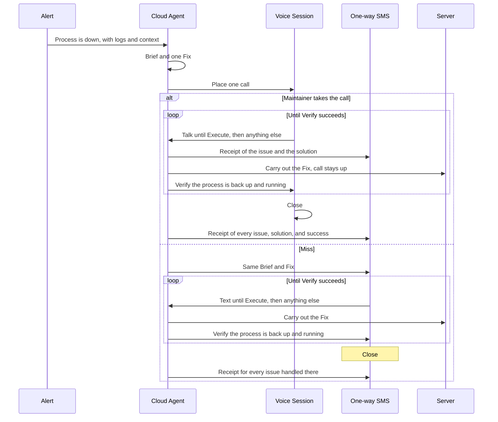

# On-call voice

When a watched process goes down, one Maintainer gets a phone call. They talk with the Cloud Agent about the one Fix, stay on the line while that Fix is carried out, and stay on the line until Verify says the process is back up and running. The call Closes at that moment. If Verify fails, the call continues.

Words used here are defined in [CONTEXT.md](CONTEXT.md). The vendor split is recorded in [docs/adr/0001-twilio-carries-the-call-cursor-speaks.md](docs/adr/0001-twilio-carries-the-call-cursor-speaks.md).

## Who does what

| Piece | Role |
| --- | --- |
| Outside alert | Opens an Incident. Brings the logs and the context. |
| Cloud Agent | Cursor cloud agent. Owns the Incident. Writes the Brief and the one Fix, talks with the Maintainer, changes the server, and Verifies the process. |
| Voice | ElevenLabs. Speaks and listens. Adds no second brain and no prompt stack. |
| Phone and SMS | Twilio. Places the one outbound call. Carries the Text Session and the Receipt. |

One Maintainer. One phone number. One Incident at a time.

The Cloud Agent works in runs. The Brief and the Fix are finished before the phone rings, so the opening line does not wait. Each thing the Maintainer says after that is a new run. The call or the SMS stays quiet until that run finishes, then speaks the result. One run at a time. Verify is one of those runs. The line stays open while it happens.

## The loop

## Voice Session

Twilio places one outbound call. The Text Session stays closed for the whole call. The call is not replaced by SMS. A Follow-up after a Receipt still reaches the same Cloud Agent.

The first thing spoken is the Brief and the one Fix, in plain language a fifteen-year-old would follow. No padding. No raw error dump.

From there the Maintainer is talking to the Cloud Agent. They can ask, object, and change what the Fix should be. There is still only one Fix. A different idea replaces it. There is no menu.

The Fix runs while the call is still up. When it finishes, the Cloud Agent Verifies that the process is back up and running, and says what it found, in the same plain language.

- **The Fix starts.** A one-way Receipt goes out by SMS: the issue, and the solution now being carried out. The call stays up. The Text Session stays closed.
- **Verify succeeds.** The call Closes. Our side hangs up. A one-way Receipt lists every issue on that call.
- **Verify fails.** The call stays up. That Execute is spent. The Cloud Agent gives a new Brief and one new Fix. The Maintainer is still talking to the same agent. Nothing hangs up, and nothing retries, until they Execute again. The next Fix sends its own start Receipt. The Text Session stays closed.

The call has two endings:

- **Close.** Verify has succeeded. The process is back up and running.
- **Miss.** No answer, busy, declined, or a machine pickup. We hang up. We do not speak to voicemail. The Text Session opens with the same Brief and the same Fix.

A callback after a Miss does nothing. It is not answered as a Voice Session. Only the Text Session can reach Close for that Incident. This Incident is never called again.

## Text Session

SMS with the same Cloud Agent, on Twilio. It opens when the call was a Miss.

The flow matches the call, including Verify. Talk until the Maintainer says Execute. The Cloud Agent asks "anything else?" A no starts the Fix. The Text Session stays open while the Fix runs and while Verify runs.

- **Verify succeeds.** The Text Session Closes. The Receipt follows, for every issue handled in that session.
- **Verify fails.** The Text Session stays open. The Cloud Agent sends a new Brief and one new Fix. The spent Execute does not run it.

A Miss is the only reason a Text Session opens. A failed Verify on a live call stays on that call. A Follow-up does not open a Text Session and does not take the Incident off the call.

## Execute and Verify

Execute is the Maintainer telling the Cloud Agent to carry out the Fix, in ordinary language. Silence is not Execute. A bare "yes" is not Execute unless it is clearly the instruction to carry the Fix out.

Order:

1. Talk about the Fix.
2. Maintainer says Execute.
3. Cloud Agent asks "anything else?"
4. A yes continues the conversation. That Execute is spent. The Fix does not start until they Execute again, hear the question again, and answer no.
5. A no starts the Fix. On a call, the call stays up, a one-way Receipt goes out, and the Text Session stays closed. On a Miss, the Text Session is already the conversation, and it stays open.
6. The Cloud Agent Verifies the process is back up and running.
7. Verify succeeds, and the session Closes. Verify fails, and the session continues at step 1 with a new Brief and one new Fix.

Drop is separate. Drop abandons this Incident with no further Fix and no Verify. The process stays down. The call or the Text Session ends. There is no closing Receipt. A start Receipt already sent stays as it is.

## Receipt

A Receipt is one-way. It does not open the Text Session, and it does not leave a text conversation waiting during the call.

Two moments:

- **When a Fix starts.** One SMS: the issue, and the solution being carried out. Plain language, same register as the Brief, short. Each new Fix on that same call gets its own start Receipt.
- **When the call Closes.** One SMS for every issue handled on that call. For each one: the issue, the solution, and that it succeeded.

A Follow-up is the Maintainer texting after a Receipt. It goes to the same Cloud Agent, which answers by SMS. "Send the error log" is a Follow-up. The agent sends the log. It does not treat that text as Execute, and it does not place another call.

On a live call, the call stays up. The Text Session stays closed. The Cloud Agent does one run at a time, so a Follow-up waits until the current run finishes, then gets its answer. After Close, a Follow-up still reaches that same agent.

A Miss has no live call, so the Text Session is the conversation. When that session Closes, one Receipt lists every issue handled there, in the same three parts. A text after that Receipt is a Follow-up to the same agent.

## One Incident at a time

A second alert while an Incident is open waits in arrival order.

It starts when the current Incident Closes or is Dropped. A start Receipt does not end the Incident. The waiting alert then gets its own Cloud Agent, its own Brief, and its own Fix, and the loop begins again with one outbound call.

If they Drop and nothing is waiting, the loop stops. The dropped process stays down.

## v1

In this version there is one Maintainer, one outbound call per Incident, one Fix at a time, a Verify loop that keeps the call up until the process is running, SMS as the only off-call channel, and no second attempt unless they Execute again.

Later, still out of this design: an on-call rotation, a menu of fixes, WhatsApp, and calling the Maintainer a second time for the same Incident.
